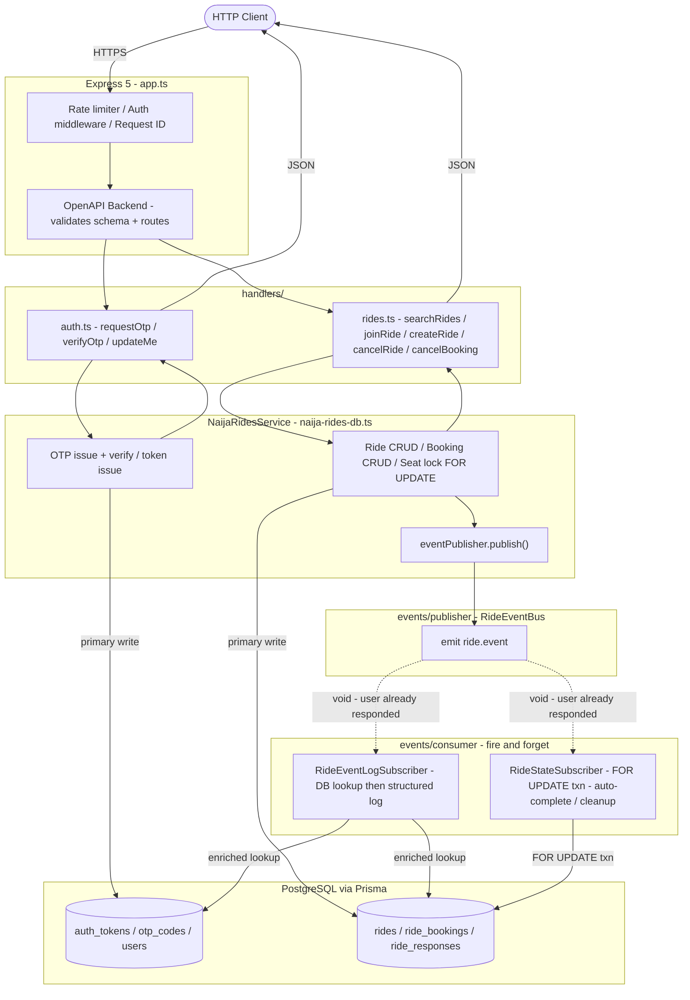
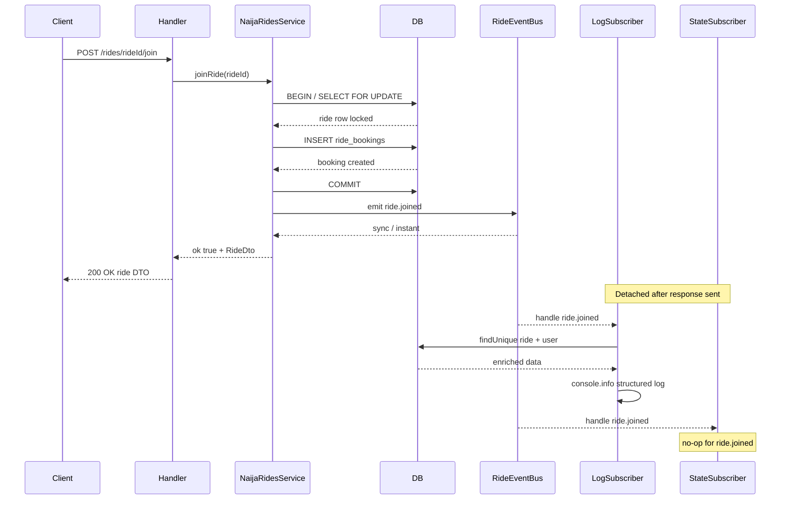
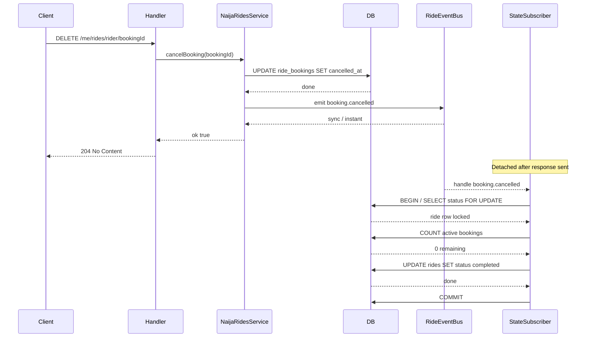

# @repo/api — NaijaRides API

Express 5 REST API for the NaijaRides carpooling platform, typed end-to-end with OpenAPI.

## Stack

- **Express 5** with [`openapi-backend`](https://github.com/anttiviljami/openapi-backend) for request validation and handler routing
- **Prisma 7** via `@repo/db` for all database access (PostgreSQL / Neon)
- **Vitest** + **Supertest** for integration tests
- **TypeScript 6** with generated types from `openapi-typescript`

## Scripts

| Command | Description |
|---------|-------------|
| `pnpm dev` | Watch mode — rebuilds and restarts on change |
| `pnpm build` | Generate OpenAPI types + compile to `dist/` |
| `pnpm test` | Run Vitest in watch mode |
| `pnpm test --run` | Run tests once (CI mode) |
| `pnpm seed` | Reset and re-seed the database with Lagos fixture data |
| `pnpm lint` | ESLint |
| `pnpm check-types` | TypeScript type check |

## Architecture

### Request / response flow



> Solid arrows block the HTTP response. Dashed arrows are fire-and-forget — the client has already received a response before these run.

### Event lifecycle — joinRide



### Event lifecycle — cancelBooking



### Consumer responsibilities

| Subscriber | Events handled | DB action |
|---|---|---|
| `RideEventLogSubscriber` | All events | Reads ride + actor from DB, emits enriched structured log |
| `RideStateSubscriber` | `booking.cancelled` | `SELECT FOR UPDATE` → auto-complete ride if 0 active bookings remain |
| `RideStateSubscriber` | `ride.cancelled` | Delete future `ride_responses` rows for the ride |

### Race-condition safety

`booking.cancelled` can fire concurrently (e.g. two riders cancel at the same moment). `RideStateSubscriber` guards against double-writes by wrapping the check-and-update in a `db.$transaction` with `SELECT ... FOR UPDATE`, which serializes concurrent handlers at the DB row level. Only the writer that sees `activeBookings === 0` after acquiring the lock will flip the status.

## Project layout

```
src/
  app.ts              Express app factory (registers all routes + subscribers)
  index.ts            Server entrypoint
  seed.ts             Runnable seed CLI
  openapi/            OpenAPI YAML spec
  openapi-types.ts    Auto-generated types (do not edit)
  auth/               Token resolution helpers
  data/
    locations.ts      Lagos location registry with aliases
    naija-rides-db.ts NaijaRidesService + seed/reset helpers
    index.ts          Barrel re-export
  events/
    publisher/        RideEventBus (EventEmitter) · types · publisher class
    consumer/         RideEventLogSubscriber · RideStateSubscriber · registry
  observability/
    metrics.ts        In-process counters (latency, auth failures, join conflicts)
test/
  global-setup.ts     Vitest global setup (Testcontainers / Neon Postgres)
```

## Authentication

The API uses a simple bearer-token scheme backed by the `auth_tokens` table. In test mode (`NODE_ENV=test`) OTP codes are always `1234`.

## Seed data

Running `pnpm seed` calls `resetNaijaRidesData()` which:
1. Clears all NaijaRides rows in dependency order
2. Re-inserts fixture users, rides, bookings, and ride responses

This is also called automatically by `beforeEach` in the test suite.
